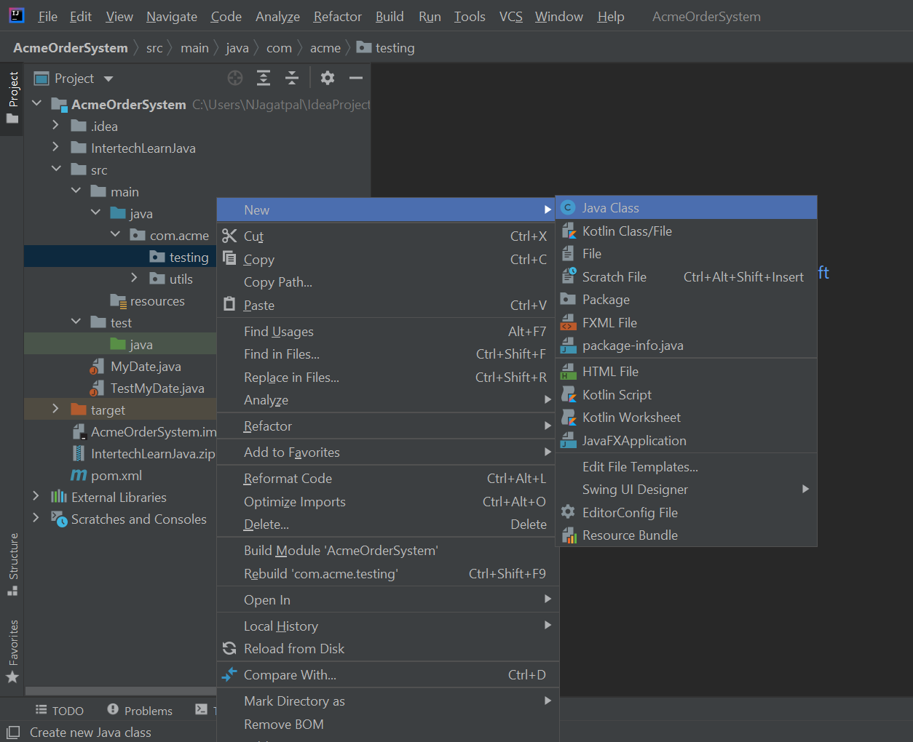

# Java-Passing-By-Value-Lab-Sec-8

## Step 1: Create a PassByExperiment class

In this step you create another testing class called PassByExperiment in the
com.acme.testing package.  
  
1.1 Create the PassByExperiment class. In the Package Explorer view, rightclick on the com.acme.testing package in the AcmeOrderSystem project and
select New > Java Class.

