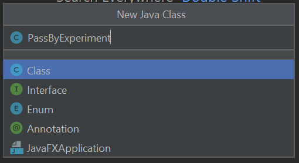

# Java-Passing-By-Value-Lab-Sec-8

## Step 1: Create a PassByExperiment class

In this step you create another testing class called PassByExperiment in the
com.acme.testing package.  
  
1.1 Create the PassByExperiment class. In the Package Explorer view, rightclick on the com.acme.testing package in the AcmeOrderSystem project and
select New > Java Class.


1.2 In the New Java Class window, enter
PassByExperiment as the name of the class, and click the Finish button.



Create a public static void main( ) method by typing main and pressing Enter.

1.3 Add a static method to PassByExperiment called passObject( ) that gets
passed a MyDate object and changes the year of the MyDate object.

```java
public static void passObject(MyDate d){
 d.year=2009;
}
```

1.4 Add a static method to PassByExperiment called passPrimitive( ) that gets
passed an int (the year of a MyDate object) and changes the int to some
other year.

```java
public static void passPrimitive(int i){
 i=2010;
}
```

1.5 Add a static method to PassByExperiment called passString( ) that gets
passed a String that represents a month/day/year and replaces the year
portion of the string with a new year. For example, if “1/20/2001” is
passed in, “1/20/2012” is passed out.

```java
public static void passString(String s){
 int yearSlash =s.lastIndexOf('/');
 s = s.substring(0, yearSlash+1);
 s += "2012";
 System.out.println("New date string: " + s);
}
```

Notice your use of a couple of the String methods (java.lang.String) and
operators (+ for concatenation and += for assignment) to get this to work.

1.6 Save your file and fix any compiler errors before moving to the next step.

Note: As this new testing class is in a different package than the MyDate class that is
getting used, what do you think is required to allow PassByExperiment to use the
MyDate class? That’s right — an import statement needs to go at the top of the page

```java
import com.acme.utils.MyDate;
```

## Step 2: Test the pass methods

### 2.1 Add code to the main( ) method to test each of the “pass” methods.  

2.1.1 In the main( ) method, first create a MyDate object.
```java
MyDate date = new MyDate(1,20,2008);
```

2.1.2 Print out the date reference before and after calling the passObject( ) method.

```java
System.out.println("Before passing an object " + date);
passObject(date);
System.out.println("After passing an object " + date);
```

2.1.3 Do the same work to write out the date’s year and call on the passPrimitive() method.

```java
System.out.println("Before passing a primitive " + date.year);
passPrimitive(date.year);
System.out.println("After passing a primitive " + date.year);
```

2.1.4 Lastly, create a String reference from toString( ) of the MyDate object. Use
this String object to call on the passString( ) method. Once again print out the String
value before and after the call to the method.

```java
String x = date.toString();
System.out.println("Before passing a String " + x);
passString(x);
System.out.println("After passing a String " + x);
```

### 2.2 Run the PassByExperiment class.
